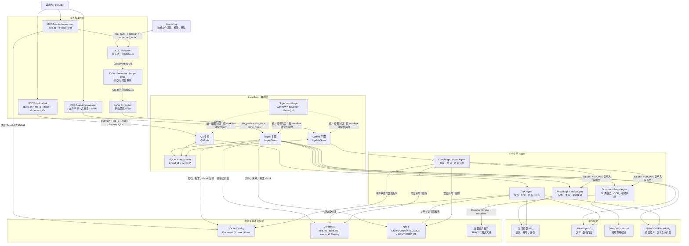
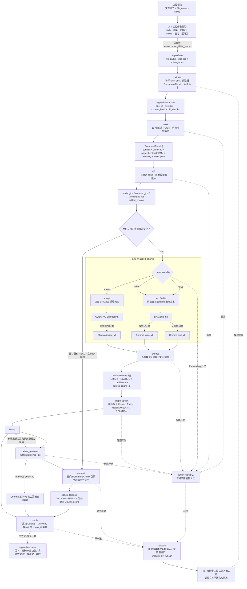
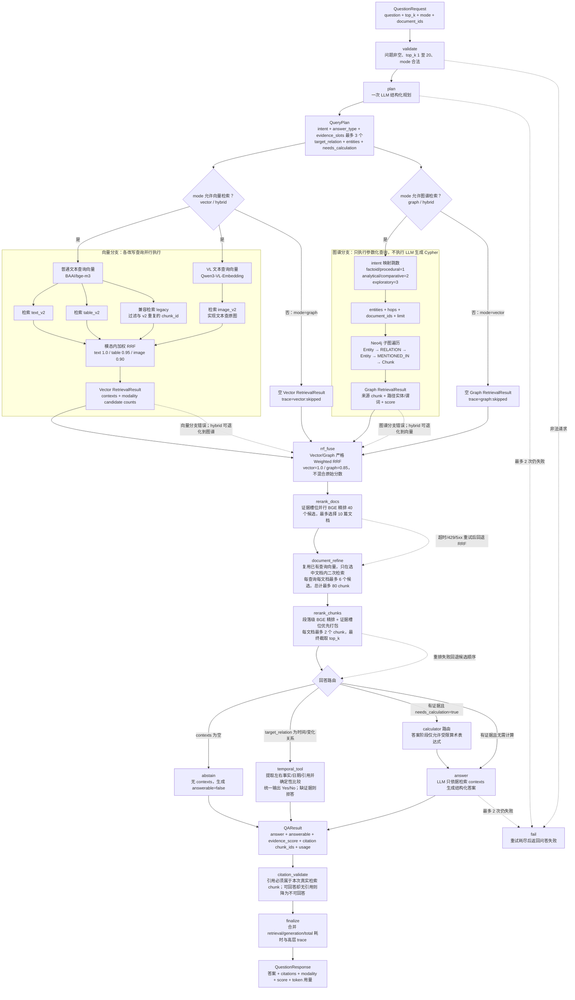
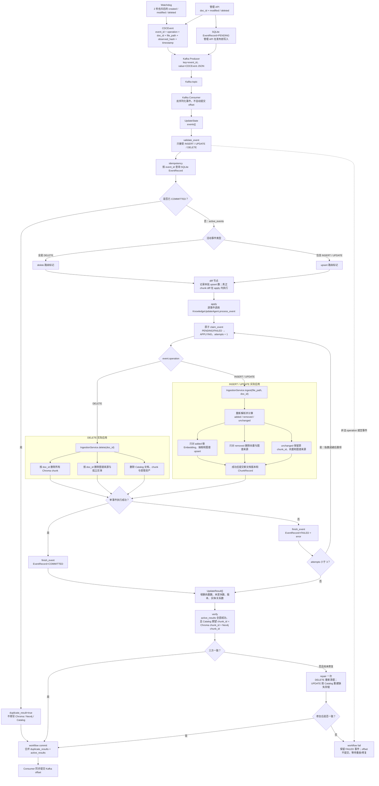

# AgentKnowledgeHub（Python）

面向企业文档的 4-Agent 知识管理 MVP。系统用 LangGraph 编排文档解析、知识抽取、
GraphRAG 问答和 CDC 更新 Agent，以 FastAPI 提供接口，ChromaDB 保存多模态向量，
Neo4j 保存带来源的知识图谱，Kafka 传递增量事件，SQLite 保存目录、版本和检查点。

> 本次实现和验收只覆盖 `python/`。Java、Go、Web UI、认证、PGVector、Debezium 不在范围内。

快速入口：[架构说明](docs/architecture.md) · [量化评测报告](docs/benchmark-report.md) · [5 分钟演示](docs/demo-guide.md) · [面试讲解](docs/interview-guide.md) · [简历写法](docs/resume-final.md)

## 已实现能力

### 4-Agent 与三条真实 LangGraph 流水线

#### 整体架构



图中实线是当前 HTTP/Kafka 的实际调用路径。FastAPI 的三个接口分别直接调用公开子图；
`Supervisor Graph` 是统一的可编程入口，根据显式 `workflow=ingest|qa|update` 做确定性分发，
不让 LLM 猜测应该进入哪条业务流水线。

#### 流水线 1：文档入库



这里的关键是 `diff` 之后只有 `added_chunks` 会重新做 Embedding 和知识抽取；
`unchanged_ids` 不触碰，`removed_ids` 才从向量库和图谱中删除。

#### 流水线 2：智能问答



这里有三层不同的“路由”：Supervisor 选择业务子图，API 的 `mode` 决定向量/图谱分支是否工作，
`QueryPlan.intent` 决定图查询跳数，并与 `target_relation` 一起选择时间工具；最后再根据证据是否
充分、是否需要计算选择时间比较、计算器、普通回答或拒答。
混合模式没有硬编码“图谱更准确所以权重更高”。

#### 流水线 3：CDC 增量更新



CDC 中的 `delete / upsert / diff` 是工作流的显式路由与追踪节点，真正的单事件修改在 `apply`
里执行。这样 Kafka 重放同一个 `event_id` 时会先命中 `COMMITTED`，直接返回重复结果，不会重复写库。

- 普通节点最多尝试 2 次，CDC 最多尝试 3 次。
- SQLite Checkpointer 支持流程恢复；`trace` 只记录阶段、路由、重试和错误类型，不返回思维链。
- 问答中的多模态向量检索和 Neo4j 1–3 跳参数化查询并行执行，不执行模型生成的 Cypher。
- 数值问题走受限计算器；无充分证据时返回 `answerable=false`；引用必须映射到真实 chunk。

### 11 类文档与真多模态处理

| 格式族 | 扩展名 | 保留信息 |
|---|---|---|
| PDF | `.pdf` | 页码、文本、表格；低文本页 OCR/视觉 |
| Word | `.docx` | 标题、段落、表格、内嵌图片 |
| Excel | `.xlsx` | 工作表、行列、单元格坐标、表头 |
| CSV | `.csv` | 行列、表头、编码 |
| 图片 | `.png`、`.jpg`、`.jpeg` | OCR、视觉描述、原始图片向量 |
| 文本 | `.txt` | UTF-8/GB18030 等编码检测 |
| Markdown | `.md`、`.markdown` | 标题层级和正文 |
| PowerPoint | `.pptx` | 幻灯片、标题、文本框、表格、图片 |
| HTML | `.html`、`.htm` | 标题、正文、表格；不抓取远程资源 |
| JSON | `.json`、`.jsonl` | JSONPath、深度和节点数限制 |
| XML | `.xml` | XPath；安全解析并禁止 XXE |

图片、扫描页和 Office 内嵌图片以 SHA-256 命名保存为受管资产。OCR 始终执行；启用视觉时，
`Qwen/Qwen3-VL-8B-Instruct` 以 `detail=low` 补充客观描述，失败自动降级到 OCR，不使整份
文档失败。删除文档时会同步清理资产。

默认约 500 token、80 token overlap 分块，并保留页码、章节、工作表、坐标、模态、版本和
内容哈希。`chunk_id` 由文档、来源单元、规范化内容和重复序号确定，未变化块跨版本保持稳定。

### 独立向量化与 GraphRAG 融合

ChromaDB 使用三个 v2 集合：

- `knowledge_text_v2`：文本，使用 `BAAI/bge-m3`。
- `knowledge_table_v2`：带表头及坐标的结构化表格文本，使用 `BAAI/bge-m3`。
- `knowledge_image_v2`：原始图片，使用 `Qwen/Qwen3-VL-Embedding-8B`，不是只嵌入 OCR 文本。

查询同时生成普通文本向量和 VL 文本查询向量，并行检索三个集合；集合内排名归一化后按
文本 `1.0`、表格 `0.95`、图片 `0.90` 做加权 RRF，再与 Neo4j 子图结果融合。迁移期间仍可
读取旧 `knowledge_chunks` 集合，但同一 chunk 不会因同时存在于新旧集合而重复加分。
向量与图谱分支使用严格 Weighted RRF（默认权重 `1.0/0.85`），不混合不同来源的原始分数。
融合后的 40 个候选由硅基流动 `BAAI/bge-reranker-v2-m3` 按必需证据槽位并行精排；精排排名与
原始 Weighted-RRF 排名再次通过 RRF 融合，避免覆盖向量/图谱召回信号。系统复用首次生成的
文本/VL 查询向量，只在最多 10 篇候选文档内二次检索。最终 Top-K 先覆盖必需证据槽位，再按
融合分数自适应回填，每篇文档最多两个 chunk，不强制每篇候选文档都进入上下文。时间比较缺少
一侧证据时允许执行一次复用查询向量的深检索。Rerank 超时、429 或 5xx 最多重试两次，仍失败则
回退 RRF 候选，不中断回答。

实验性的通用 ComparisonTool 被保留用于消融，但默认 `COMPARISON_TOOL_ENABLED=false`。固定
100 题实验显示它提高了跨文档证据完整性，却因过度拒答降低 Answer EM；默认链路继续使用语义
明确的时间比较工具。这个取舍及失败案例见[量化评测报告](docs/benchmark-report.md)。

Neo4j 使用 `Entity`、`Chunk`、`MENTIONED_IN` 和通用 `RELATION` 来源模型；实体和关系都保留
`source_chunk_id`。删除 chunk 时同步删除向量、来源节点及关系，仅在没有其他来源时删除孤立实体。

### CDC 增量更新

Watchdog 和管理 API 只生产统一事件，Kafka Consumer 执行更新。事件包含 `event_id`、
`operation`、`doc_id`、`file_path`、`observed_hash`、`timestamp`，支持 2 秒去抖和幂等重放。

更新时按稳定 ID/hash 计算 `added / changed / deleted / unchanged`，只嵌入和抽取新增或变化块，
只删除消失块。跨 SQLite、ChromaDB、Neo4j 采用幂等写入和
`PENDING → APPLYING → COMMITTED/FAILED` 状态；一致性修复和全量重建命令用于恢复。

### 上传安全

默认文件上限 50 MB。API 校验文件名、目录穿越、扩展名、MIME、文件签名、压缩包成员路径、
成员数量、解压总大小及加密状态，并限制 PDF 页数、工作表数量、JSON/XML 深度和节点数。
HTML 不访问外部资源，XML 禁止实体展开；解析失败返回明确 4xx，不写入错误文本。

## 当前验证状态

以下是 2026-08-31 的工程验证与固定 MultiHop-RAG 实验结果：

| 项目 | 实测结果 |
|---|---:|
| 自动化测试 | 126 passed，1 个真实 API 用例按标记排除 |
| 核心模块行覆盖率 | 87.94% |
| Ruff | All checks passed |
| Docker Compose | FastAPI、ChromaDB、Neo4j、Kafka 4/4 healthy |
| Docker 11 格式端到端测试 | 1 passed（Fake 模型，不计费） |
| 最终默认链路固定回归 | 20/20 Vector/Hybrid 记录，契约检查全部通过，0 业务错误，0 Rerank fallback |
| 真实视觉预检 | 成功，描述 401 字符 |
| 真实 VL Embedding 预检 | 图片/文本均 1024 维，2 calls / 42 input tokens |
| 真实预检总耗时 | 6850.283 ms |

| 固定 100 题配对指标 | Vector | Hybrid |
|---|---:|---:|
| Evidence Recall@10 | 74.44% | 76.78% |
| All-evidence Hit@10 | 45.33% | 50.67% |
| Answer EM | 60.00% | 57.33% |
| Citation Recall | 40.67% | 43.78% |

Hybrid 的 All-evidence Hit@10 提升 `5.34 pp`，说明图候选提高了跨文档证据完整性；但 Answer EM
下降 `2.67 pp`，其配对 bootstrap 95% CI 为 `[-10.67, 5.33] pp`，不支持“GraphRAG 显著提升
回答准确率”的结论。完整设置、指标定义、版本消融与失败分析见
[docs/benchmark-report.md](docs/benchmark-report.md)。

CDC 性能和生产规模 API 压测尚未完成，因此本项目不声明“提升 22%”、“准确率 94%”、
“更新效率提升 95%”或“支持千级文档实时问答”等未经验证的数字。

## 配置与启动

要求 Python 3.12、Docker Desktop / Compose；OCR 使用 Tesseract `chi_sim+eng`，Docker 镜像已安装。

```powershell
Copy-Item python/.env.example python/.env
```

在 `python/.env` 中填写密钥，密钥不要提交：

```dotenv
LLM_BASE_URL=http://127.0.0.1:8001/v1
LLM_API_KEY=
LLM_MODEL=

EMBEDDING_PROVIDER=siliconflow
SILICONFLOW_BASE_URL=https://api.siliconflow.cn/v1
SILICONFLOW_API_KEY=
SILICONFLOW_EMBEDDING_MODEL=BAAI/bge-m3
SILICONFLOW_VISION_MODEL=Qwen/Qwen3-VL-8B-Instruct
SILICONFLOW_VL_EMBEDDING_MODEL=Qwen/Qwen3-VL-Embedding-8B

VISION_ENABLED=true
EMBEDDING_DIMENSIONS=1024
EMBEDDING_BATCH_SIZE=10
MODALITY_TEXT_WEIGHT=1.0
MODALITY_TABLE_WEIGHT=0.95
MODALITY_IMAGE_WEIGHT=0.90
RRF_CONSTANT=60
HYBRID_VECTOR_WEIGHT=1.0
HYBRID_GRAPH_WEIGHT=0.85
HYBRID_MAX_CHUNKS_PER_DOCUMENT=1
RERANK_ENABLED=true
RERANK_MODEL=BAAI/bge-reranker-v2-m3
RERANK_CANDIDATE_K=40
RERANK_TOP_DOCUMENTS=10
RERANK_LOCAL_CANDIDATES_PER_QUERY=6
RERANK_MAX_LOCAL_CANDIDATES=80
RERANK_MAX_CHUNKS_PER_DOCUMENT=2
RERANK_TIMEOUT_SECONDS=30
RERANK_MAX_RETRIES=2
COMPARISON_TOOL_ENABLED=false
ANSWER_MAX_CONTEXT_CHUNKS=8
ANSWER_MAX_CONTEXT_CHARS=18000
```

示例假设 OpenAI-compatible 服务在宿主机 8001 端口。Docker 中默认改写为
`http://host.docker.internal:8001/v1`；使用其他地址时，在执行 Compose 前设置
`DOCKER_LLM_BASE_URL`。`.env` 已从 Git 和 Docker build context 排除。

Dockerfile 默认使用阿里云 PyPI 镜像；也可临时覆盖：

```powershell
docker compose build --build-arg PIP_INDEX_URL=https://pypi.org/simple api
docker compose up -d
docker compose ps
Invoke-RestMethod http://127.0.0.1:8080/api/health/ready
```

Swagger：<http://127.0.0.1:8080/docs>；Neo4j Browser：<http://127.0.0.1:7474>。

## 本地开发与测试

```powershell
cd python
py -3.12 -m venv .venv
.\.venv\Scripts\python -m pip install -i https://mirrors.aliyun.com/pypi/simple/ -e ".[dev,benchmark]"
.\.venv\Scripts\ruff check .
.\.venv\Scripts\pytest --cov=agents --cov=api --cov=orchestrator --cov=services
```

CI 使用 Fake Chat、Fake Embedding、Fake Vision 和 Fake VL Embedding，不需要真实密钥。

## API

| 方法 | 路径 | 用途 |
|---|---|---|
| POST | `/api/ingest/upload` | 同步上传单个文档 |
| POST | `/api/ingest/batch` | 最多并发 2 的批量上传 |
| POST | `/api/qa/ask` | `vector / graph / hybrid` 带引用问答 |
| POST | `/api/admin/update` | 按 `doc_id` 生产更新或删除事件 |
| GET | `/api/admin/events/{event_id}` | 查询 CDC 状态 |
| GET/DELETE | `/api/documents/{doc_id}` | 查看或完整删除文档 |
| GET | `/api/admin/stats` | 三个向量集合、图谱、生成模型及 Reranker 用量/延迟/降级统计 |
| GET | `/api/health/live` | 进程存活检查 |
| GET | `/api/health/ready` | SQLite、Chroma、Neo4j、Kafka 和模型配置检查 |

问答 citation 保留 `doc_id/chunk_id/page/sheet/quote/score/type/modality`；响应同时返回
`answerable`、`evidence_score`、分阶段延迟、模型/token 用量和高层 trace。

## 运维与迁移

```powershell
cd python
.\.venv\Scripts\akh-admin preflight
.\.venv\Scripts\akh-admin preflight-multimodal
.\.venv\Scripts\akh-admin migrate-multimodal --dry-run
.\.venv\Scripts\akh-admin migrate-multimodal
.\.venv\Scripts\akh-admin migrate-multimodal --doc-id <doc_id>
.\.venv\Scripts\akh-admin repair
.\.venv\Scripts\akh-admin repair --doc-id <doc_id>
.\.venv\Scripts\akh-admin rebuild <doc_id>
```

迁移命令可断点续跑、逐文档隔离失败并校验 v2 chunk；验证前不会删除旧集合。

## 数据与评测状态

数据下载器、manifest、固定样本选择、查询计划缓存、断点续跑和报告工具均保留；MultiHop-RAG
语料按本轮成本约束使用固定 100 篇文档子集。v2/v3/v4/v5 原始 JSONL、summary 和 gate 报告位于
`python/benchmarks/results/reference/`，不同实验从不互相覆盖。专用命令依次执行真实 Rerank 单请求
预检、分层 10 题预检和分层 100 题门控；任一门槛失败即停止，只有全部通过才续跑剩余 200 题：

```powershell
cd python
.\.venv\Scripts\akh-benchmark dry-run
.\.venv\Scripts\akh-benchmark run-multihop-v5 --confirm-live
.\.venv\Scripts\akh-benchmark run --suite all --fresh-state --no-resume --confirm-live
.\.venv\Scripts\akh-benchmark report
```

当前 100 题门控未通过，程序按设计停止，没有为了得到好看的数字继续付费或调整样本。最终默认关闭
实验性的通用 ComparisonTool；在重新完成同一固定 100 题前，只把它视为工程策略回滚，不声称产生
新的量化提升。

数据来源、许可和校验信息见 `python/benchmarks/manifest.json` 与
`python/benchmarks/manifest.lock.json`。RGB 仅用于 CC BY-NC-SA 4.0 许可范围内的非商业评测。

硅基流动能力说明：[多模态视觉接口](https://docs.siliconflow.cn/cn/userguide/capabilities/multimodal-vision)、
[Embedding 接口](https://docs.siliconflow.cn/cn/api-reference/embeddings/create-embeddings)。
